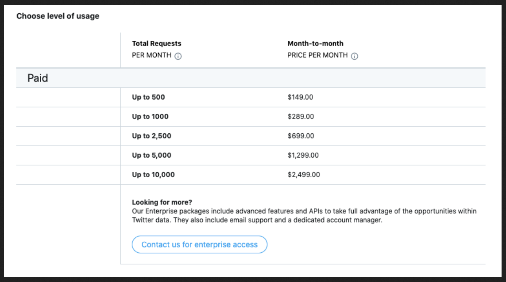
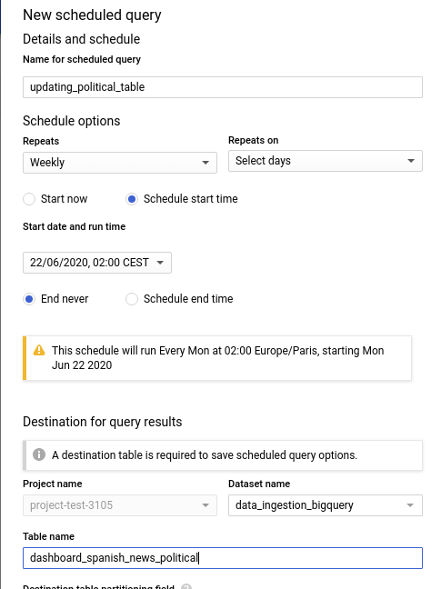
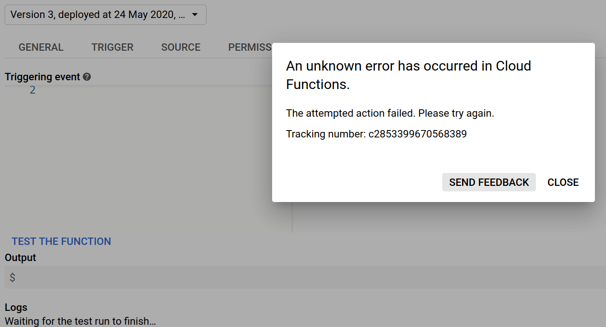

# Socioeconomic Portrait Project.

- Above buttons enable a better visualization: select wanted keywords you want to study and exclude the others:

The final dashboard:
- https://datastudio.google.com/reporting/755f3183-dd44-4073-804e-9f7d3d993315

-----------------------------

Motivation:

Is there a way of monitoring some aspects of the global crisis in Spain? I believe so, and this is the motivation to develop this **automated** ETL process in Google Cloud involving **Google Trends**, sentiment analysis and influence in news through the **Gdelt Project** and **Twitter**, from raw data acquisition to the final dashboard. Thanks to it, I have been fighting with credentials, permissions, storage locations, processing locations, 3rd party authentications, Cloud Functions, pipelines, trigger schedulers with different time format, Dataprep global updates, etc... And I learned a lot in the way, quaratine fun! :D

Thanks to Patricia, who worked in very interesting methodologies with Twitter. Here you can find her content => https://medium.com/@patricrp/buscando-contenido-con-la-api-de-twitter-f3c12994a77f

-------------------------------

1. **Introduction**
2. **How to use**
3. **Results**
4. **Analyzing results**
5. **Conclusion**
6. **Further improvements**
7. **Documentation**

------------------------------

# 1. Introduction.

  
Click to expand

  
----------------- 

Let's show a social point of view of the pandemic's impact in Spain, through an automated ETL involving the following tools in Google Cloud:

- Billing: create a maximum budget to avoid unexpected fees (10€,20€,300€... What suits your project).
- Cloud Function number: Python script sending data to Cloud Storage.
        - Requesting data from Google Trends API.
- Pub/Sub topic: Triggers (activates) the Cloud Function.
- Cloud Scheduler: Schedule a Pub/Sub topic.
- Cloud Storage: Data Lake. Gets fed periodically with the python script.
- Transfer: Load periodically from Cloud Storage to BigQuery (done before with Dataprep, but on September 2020 they will change their pricing and it is going to be unaffordable for any personal project).
- BigQuery: Data Warehouse. 
        - Creates different tables with the output of dataprep. 
        - Performs a weekly query modifying tables.
- Data Studio: Dashboard of results weekly updated, linked to the BigQuery tables.

The Python ETL pipeline is based on this article:

- **https://towardsdatascience.com/creation-of-an-etl-in-google-cloud-platform-for-automated-reporting-8a0309ee8a78**

The Gdelt Queries are based on the shared knowledge with the Data Team of Labelium España:

- **https://medium.com/@a.vargas.pina/biqquery-and-the-gdelt-project-beyond-dreams-of-marketing-analysts-62e586cc0343**

### **TROUBLESHOOTING TIME 1:** ***Golden rules for Cloud Services***:

  
Click to expand

---------------------------------

- **1. Your wallet is your sacred temple:** If you won't read all Google documentation carefully, at least go to billing and create a budget with alerts for your project, in case you do something wrong, receiving custom alerts before you spend a lot without noticing. Don't end up living under a bridge. 

- **2. Your sacred temple has no protection by default:** Budget alerts won't cap payment when the limit is reached. They just alert you so you have time to turn everything down in case of panic. It can be configured to cap tho. 
- **3. Worship Location:** While working on the different stages of your project, pay attention to put all your stuff in the very same region. Beware of headaches if don't. 
- **4. Don't panic:** That's all.

--------------------

### Used tools to analyse the internet in Spain:

  
Click to expand

-----------------------------------

***Google Trends***:

- Python. 
- Pytrends library.

Google Trends is a tool that analyses the popularity of top search queries in Google Search across various regions and languages. Basically, what people are looking for in Google.

Google trends searches the maximum on the specified period, makes that maximum the 100% of Trend Index and everything else in the requested dates averaged by that top. If you request information weekly, you will have a point with 100% of Trend Index each week, regardless how popular it is. 

- If you request a list of elements, all elements will be averaged by the top one.

- If you request each of your keywords separately, each keyword will be averaged on time by its own top.

So basically there are 2 ways of using it: Compare the evolution in time of different keywords, or checking the evolution in time of every keyword, each one separately. We took the 2nd path.

- César discovered how tricky is Pytrends. The idea of requesting all at once but separately is his => https://www.linkedin.com/in/cesar-castanon/

-----------------------

***Twitter***: 

Using Tweepy, the Python's library for Twitter requests to generate dataframes for each query.  The built-in function Cursor help to develop a function to create a dataframe and include all tweets from the last 7 days related to a word, recording date, user, id and text for each tweet. The function search includes a complex query, geolocation and language to get only tweets from Spanish people.

We used Twitter Standard API, the *freemium* service, so results were limited up to 7 days and a maximum of mixed results from popular and recent tweets.

This helped us to know what were people talking about unemployment and its effects during COVID-19.

In the twitter folder there is merging-datasets script, you can find the twitter requesting script here, and the process here: 

- **https://medium.com/@patricrp/buscando-contenido-con-la-api-de-twitter-f3c12994a77f**

By the way, work *seriously* with twitter is quite expensive, and we do love programming, but our budget, as our leisure time, is limited.

-------------------------------

***Gdelt Project***: 

- SQL. 
- Bigquery.

The Gdelt Project is a database with all the news of the world, updated every 15 minutes. It also classifies the incoming data, so you can search topics, themes, people, related people to them... It is impressive, and available in almost 70 languages via BigQuery.

- https://www.gdeltproject.org/

-------------------------------------------

We want to monitor what spanish news say about certain topics, so the process is the following:

1. Create a dataset with all the spanish newspapers (paper version and digital ones). Taking a glance to  *bigquery/spanish_newspapers.py* you can figure out the created dataset (>150 different media).

2. Make a bigquery table with that dataset.

3. Select the *themes* you want to monitor in the Gdelt database. In *bigquery/bigquery_gdelt_themes_list.sql* you can find all themes available.

4. Make a query filtering by your goals, contrasting against the created table of spanish media and loading the data into a new table, the *main table*. 

5. Divide the info of the *main table* in different tables, for different graphs in Data Studio (to get a faster visualization in Data Studio)

6. Schedule the overwriting of *main table*, to get periodical updates.

7. Schedule the appending of new info to the dashboarding tables.

Updating tables:

List of scheduled queries (Google Trends included)

8. Plot it in Data Studio.

- Alex taught me how to UNNEST and EXTRACT. Kudos for the sentiment extraction => https://www.linkedin.com/in/alexmasip/

- Jesús gave me a hand with some final SQL statements :) => https://www.linkedin.com/in/jralvarez1986/ 

------------------------------
-------------------------------

# 2. How to:

  
Click to expand

 
------------------------

### Billing.

  
Click to expand

 
------------------------
In Cloud environment, select your project, go to billing, and take a glance. Just select a weekly/monthly budget to your project, remember that it is linked to your bank account and a wrong action can cost a lot of money if you don't pay attention.

In Notification Channels you can choose a lot of options, whatever suits you.

--------------------

### Create a new project and get your credentials here:

  
Click to expand

 
------------------------

https://console.cloud.google.com/projectselector2/iam-admin/serviceaccounts?_ga=2.187077160.1256540572.1587286598-806021438.1579453370&pli=1&supportedpurview=project

- Service Account: Give it a nice name.
- Role: Storage Object Admin, Cloud Function

----------------

### Create a bucket in Cloud Storage

  
Click to expand

 
------------------------

https://console.cloud.google.com/storage/create-bucket?
        
- Configure it: Due to our requirements we will use region location (**Europe Multi-region**). Be careful, it can give you a hard headache, mainly if working with BigQuery or data from other regions that are not your selected one. Always locate all buckets where all data sources you are using for the same project. 

----------------

### Python script

  
Click to expand

 
------------------------

*The Python script I'm using is available in the Cloud Function folder*.

- Make sure it runs fine in your PC before uploading to Cloud Function. It is a hassle debugging in the Cloud.

- If you are following my steps (gcsfs library) and a *NotFounderror* arises while trying to upload to Cloud Storage, try the first time uploading manually the requested csv(s) to Cloud, and after that you'll automate the reading/overwriting of this csv(s)

Pytrends (keywords without accents or capital letters. Script available in Cloud Function). The chosen keywords for this project are in the ***cloud_function/requesting_from_pytrends.py***  folder.

- Google Trends: 
        - Has the option of select in which category you want to find your keywords. We have our reasons to not include categories in the code.
        - **Important**: When the requested information is more than a month, it is delivered grouped by week. That means you need to choose carefully when you will start requesting.

It is important to clarify the second point: In my script, I was weekly requesting information from 2019-01-01 to the last sunday, and the script was activated every monday. The problem is the following: 2019-01-01 was Tuesday. Due to the fact that my wanted information was delivered grouped by week, it didn't reach every last sunday, it reached until every last tuesday, so I always was missing 5 days of valuable information and at the end of the week it seemed like I had a 2-week delay for some unknown reason. (I realised while having a shower :D)

- Moreover, instead of appending new information to our tables each week, we are overwriting them intentionally. This is due to how Google process and delivers information from Trends.

If you want another approach, this is an awesome tutorial:

- https://searchengineland.com/learn-how-to-chart-and-track-google-trends-in-data-studio-using-python-329119

### Deploy the scripts on Google Cloud Function:

  
Click to expand

 
------------------------

1. Create a function here
        
- https://console.cloud.google.com/functions/add?
         
2. Trigger: Pub/sub
3. Give a name to your pub/sub topic and select it
4. Runtime: Python 3.7
5. Stage bucket: The bucket you created in GCS
6. Advanced options. Region: Select the same region than the created bucket in GCS (**this is very important**)
7. Service account: The same which you used to export your json credentials.
8. Advanced options. Environment variables: In the code, for private stuff like paths or keywords, instead of writing them, do something like <os.getenv("PROJECT_NAME")> (check the code). Then in this section, write PROJECT_NAME and its real value, both without the str symbol (" "). It looks like it does not work with os.dotenv. If you want to see how to use env variables => https://github.com/albertovpd/cloud_function_example_pytrends 
9. Function to execute: main

- You can measure on your pc how much your script lasts and how much memory uses. Then try using that measurements for the configuration (on RAM and timeout). If you get errors (being completely sure your script works fine and attending to the logs), raise them until it works.
 
 Why the pub/sub topic is **main** or questions about the script structure can be found here:

- https://github.com/albertovpd/pytrends_cloud_function_example

----------------------

### **TROUBLESHOOTING TIME 2:** 

  
Click to expand

 
------------------------

If you can deploy your funciton perfectly but testing it you get the following error:

Try debugging the following:

1. When configuring the CF, use a large timeout and memory, in that order. If it works, start reducing that parameters until you use the minimum and still works (if you are going to work with increasing data with time you should foresee that first before assigning the minimal capacity).

2. If nothing seems to work out you should double-check the permissions associated to the used Credentials Accounts.

I have been stuck some time with this error. Maybe some information found here can be useful:

- https://stackoverflow.com/questions/62064082/unknown-error-has-occurred-in-cloud-functions/62119865#62119865

- https://www.reddit.com/r/googlecloud/comments/gs2gd9/an_unknown_error_has_occurred_in_cloud_functions/

- https://www.reddit.com/r/cloudfunctions/comments/gu37ye/huge_amout_of_allocated_memory_needed_for/

-------------------

### Scheduling

  
Click to expand

 
------------------------

### Go to Cloud Scheduler to schedule your topic.

- https://console.cloud.google.com/cloudscheduler/appengine

1. Select the same region than all before
2. Follow instructions and run your job to make sure it works :)
- Be careful copypasting your Pub/Sub. "trigger" and "trigger " are not obviously the same.

### Bigquery 1:

- Create a dataset with the same location than the rest of the project.
- Create a table with the elements of the Cloud Storage bucket (this will be updated with DataPrep)

### Transfer:

  
Click to expand

 
------------------------

- Go to Bigquery => Transfer. 

From there, it is really user-friendly to find your data in Cloud Storage, choose a dataset in Bigquery, append/overwrite the table within the dataset (in our case, append), and schedule it.

There is also the option of triggering it with Pub/Sub, but it is not necessary for me.

A cool option is, once the data is loaded from Cloud Storage to Bigquery, you can configure Transfer to erase the Cloud Storage bucket content (I understand this can save money if you are dealing with heavy volumes of data).

In our case:
- MIRROR the bucket info to the BQ table (because, as explained here, Google Trends works weirdly and the receiving info varies regarding the date interval the user is requesting).
- Ignore 0 errors
- "," as delimitation field
- Exclude 1st row (1st row has the column names)

*If you modify the content of Storage, wait at least 1 hour before using Transfer again, as said in this thread https://stackoverflow.com/questions/61126019/not-able-to-update-big-query-table-with-transfer-from-a-storage-file*

### Dataprep:

  
Click to expand

 
------------------------

**This is not part of the pipeline anymore. It has been changed by Transfer. Nevertheless I leave here the information, in case someone finds it useful.**

Dataprep will load and transfer files from Cloud Storage to BigQuery tables in a scheduled process.

- Select your project

- **Very important:** Go to <Settings/profile> and <Settings/project/Dataflow Execution> to locate your Dataprep folder in the same region than the rest of your other Google tools. 

- Go to Cloud Storage and check the location of the dataprep-stagging bucket. If it is not in the location of your project, create a new bucket. In Dataprep/Preferences/Profile modify location of temp directory, job run directory and upload directory.

- Workflow: Manual Job (for testing):

        - Select the Cloud Storage bucket (dataset or datasets).
        - Create a recipe.
        - Select an output for the recipe, Select the BigQuery table you will feed (I think it should be done in Bigquery First).
        - Select wether you want to append or modify the existing tables in BigQuery.
        - In the workflow, use the calendar icon to schedule it (beware of time formats between Cloud Function, Dataprep, BigQuery... Use always the same location (if you can)).

- When the job works fine, do exactly the same but with a scheduled job.

--------------------------------

### **TROUBLESHOOTING TIME 3:**

  
Click to expand

 
------------------------

Follow all mentioned above. Dataprep processes are veeery slow, so you can waste a lot of time waiting for the job to be done and going to the log console.

In our case:

        - Dataflow Execution Settings: Europe-West1 (Belgium)
        - AutoZone
        - n1 standard
        - Truncate table in Bigquery (we'll overwrite continuously the Google Trends data due to how Google Trends works)

-------------------------------------------------

### Bigquery 2:

  
Click to expand

 
------------------------

1. Go there.
2. Create a scheduled query requesting from the tables periodically fed by Transfer, and save them in other tables.

The motivation for this is the following: Data Studio is the cheapest when the dashboarded data is allocated in BigQuery tables. So, if you have all the needed info in a BigQuery table, is a good option to create as much tables as graphs you will have in your Data Studio. Don't create tables randomly, just plan beforehand what you want to show in your dashboard, and how do you want to show it. 

In ***bigquery/tables_python_api*** is available the sql query of Pytrends, in case you want to take a glance.

### Data Studio:

  
Click to expand

 
------------------------
Find your tables in BigQuery and make some art.

**Warning:** I learnt by the hard way not to use Custom Query option in DataStudio, because every time someone opens the dashboard, the query will be performed, and it can cost you kind of A LOT. So always, create your dashboards from BigQuery tables.

Hopefully reddit has a great BigQuery community, and it worth taking a glance there. This was the issue if you're curious: https://www.reddit.com/r/bigquery/comments/gdk5mo/some_help_to_understand_how_i_burnt_the_300_and/

------------------------------

**- Gdelt Project.**

  
Click to expand

 
------------------------

- Filter by country with the help of a personal table, with all main national news (not all national webpage as the .es domain).
- Analyse the sentiment of each filtered news.

The query is available in this folder: ***bigquery_gdelt_project_sql***

---------------------------
-------------------------

# 3. Results

Results can be found here:

https://datastudio.google.com/s/iV7dE0FHYSM

-------------------------
------------------------

# 4. Analyzing results

  
Click to expand

 
------------------------

Do you remember when refugees or nationalism were main topic on TV in Spain? The topic will come back for other reasons like an economical crisis across Europe?  How long is going to be the keyword "economical war" the main topic of some politicians?

The circumstances we live right now are temporal or it will be part of our future? 

People will spend more money on non necessary purchases like ordering food from home?

Remote working will last after the crisis?
 
At this date, friday 05/06/2020, it is not easy to give an answer, nevertheless this project could set the basis of how understanding the short term past, the present, and maybe the close future.

-----------------------
-----------------------

# 5. Conclusion 

  
Click to expand

 
------------------------

- This project has being very useful to reinforce my Google Cloud domain, which is the main goal, and it is accomplished.

- The second goal is to get more expertise working with Gdelt, performing more accurate filters. After creating my own tables, testing the Gdelt info against it, extracting, unnesting, requesting by last week regardless the day... I think I learned a lot, and also had fun. I do love Gdelt and starting to really appreciate and understand the power of Bigquery SQL.

- It is a drawback the fact that Google Trends delivers information in a *quite weird manner*, it is already processed, and for instance, requesting weekly is pointless for our purposes, you have to request all the period you want to analyse at once. Also doing that implies that the information is delivered by blocks, so if I request information every monday from 1st january 2019, I will get all the info grouped by week, without the last week, making the dashboard look like it is not up to date.

- Working with Twitter in a professional manner is very expensive, out-of-fun-budget. You need to request all written twitters in a region/time, and then analyse that info. We did not see a cheap way of requesting just the number of times a concrete word appears, for example. The requesting is also very slow... I don't want to imagine how expensive could be to have a VM instance requesting and processing 24/7.

---------------------
---------------------

# 6. Further improvements.

  
Click to expand

 
------------------------

- Better research on themes to follow in Gdelt.
- Use Python APis to track Stock Markets on time, and add it to the dashboard :)
- I am in the process of automating an ML algorithm to infere how many times the keyword ***"unemployment"*** is searched in Google one week ahead. 

----------------------------
-------------------------------

# 7. Documentation:

  
Click to expand

 
------------------------

- What is Google Trends (no code)   https://www.karinakumykova.com/2019/03/calculate-search-interest-with-pytrends-api-and-python/

- List of categories: https://github.com/pat310/google-trends-api/wiki/Google-Trends-Categories

- Official documentation: https://pypi.org/project/pytrends/
- Info about how it works: https://www.karinakumykova.com/2019/03/calculate-search-interest-with-pytrends-api-and-python/
- The "real" Google Trends: https://towardsdatascience.com/google-trends-api-for-python-a84bc25db88f
- A great tutorial https://searchengineland.com/learn-how-to-chart-and-track-google-trends-in-data-studio-using-python-329119

- https://github.com/albertovpd/pytrends_cloud_function_example

- The Python ETL pipeline is based on this article **https://towardsdatascience.com/creation-of-an-etl-in-google-cloud-platform-for-automated-reporting-8a0309ee8a78**

- The Gdelt Queries are based on the shared knowledge with the Data Team of Labelium España: **https://medium.com/@a.vargas.pina/biqquery-and-the-gdelt-project-beyond-dreams-of-marketing-analysts-62e586cc0343**

- The final dashboard: - https://datastudio.google.com/reporting/755f3183-dd44-4073-804e-9f7d3d993315

- Twitter code and how-to: **https://medium.com/@patricrp/buscando-contenido-con-la-api-de-twitter-f3c12994a77f**

- https://github.com/albertovpd/automated_etl_google_cloud-social_dashboard

--------------------------------
-------------------------------

Many thanks to:

- **Alex Masip**, Head of Data at Labelium España https://www.linkedin.com/in/alexmasip/
- **César Castañón**: https://www.linkedin.com/in/cesar-castanon/
- **Jesús Rodríguez**:https://www.linkedin.com/in/jralvarez1986/ 

---------------------

Project by **Patricia Carmona** and **Alberto Vargas**.

- https://www.linkedin.com/in/carmonapulidopatricia/

- https://www.linkedin.com/in/alberto-vargas-pina/

----------------
----------------

# Developer notes.

  
Click to expand

 
------------------------

- Cloud Storage: Bucket in Europe multi-region (dataprep has not Europe-London location).

- Cloud Function: Testing it will modify the outcome in Cloud Storage.

- Cloud Scheduler for triggering the Cloud Function: 0 7 * * 1 Europe(Germany). It means it will run every monday at 7:00 (GTM2. 0=Sunday => 1=Monday).

- Transfer to load from Storage to BigQuery: Germany. Weekly, on Monday at 26/10/2020, 08:30. *Be careful, if you modify the content of Cloud Storage it will last at least 1 hour to be appreciated by Transfer, as said in this thread https://stackoverflow.com/questions/61126019/not-able-to-update-big-query-table-with-transfer-from-a-storage-file you'll get an nice log like "no changes have bee appreciated to modify the table*

- BigQuery pytrends: This schedule will run Every Mon at 04:00 Europe/Berlin, starting Mon Jun 08 2020.

- BigQuery Gdelt.

        - Overwriting the *main table*: This schedule will run Every Sun at 23:59 Europe/Paris, starting Sun Jun 21 2020.

        - Appending to dashboard tables: This schedule will run Every Mon at 02:00 Europe/Paris, starting Mon Jun 22 2020

**Very important**: My project is in EU but Gdelt is in US. My Gdelt dataset is also in US => don't forget processing location US

------------------------------
------------------------------